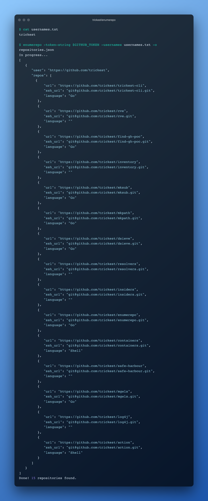

<h1 align="center">enumerepo <a href="https://twitter.com/intent/tweet?text=enumerepo%20-%20Read%20a%20list%20of%20GitHub%20usernames%20and%2For%20organizations%2C%20verify%20their%20existence%2C%20and%20list%20the%20repositories%20owned%20by%20each%20one%20%40trick3st%0Ahttps%3A%2F%2Fgithub.com%2Ftrickest%2Fenumerepo&hashtags=bugbounty,bugbountytips,infosec"></a></h1>
<h3 align="center">List all public repositories for (valid) GitHub usernames</h3>



Read a list of GitHub usernames and/or organizations, verify their existence, and list the repositories owned by each one. 

# Installation
## Binary
Binaries are available in the [latest release](https://github.com/trickest/enumerepo/releases/latest).

## Docker
```
docker run quay.io/trickest/enumerepo
```

## From source
```
go install github.com/trickest/enumerepo@latest
```

# Usage
```
  -adjust-delay
    	Automatically adjust time delay between requests
  -delay int
    	Time delay after every GraphQL request [ms]
  -o string
    	Output file name
  -silent
    	Don't print output to stdout
  -token-file string
    	File to read Github token from
  -token-string string
    	Github token
  -usernames string
    	File to read usernames from
```

### Example
##### usernames.txt
```
trickest
```

```shell script
$ enumerepo -token-string $GITHUB_TOKEN -usernames usernames.txt -o repositories.json
In progress...
[
   {
      "user": "https://github.com/trickest",
      "repos": [
        {
            "url": "https://github.com/trickest/trickest-cli",
            "ssh_url": "git@github.com:trickest/trickest-cli.git",
            "language": "Go"
         },
         {
            "url": "https://github.com/trickest/cve",
            "ssh_url": "git@github.com:trickest/cve.git",
            "language": ""
         },
         {
            "url": "https://github.com/trickest/find-gh-poc",
            "ssh_url": "git@github.com:trickest/find-gh-poc.git",
            "language": "Go"
         },
         {
            "url": "https://github.com/trickest/inventory",
            "ssh_url": "git@github.com:trickest/inventory.git",
            "language": ""
         },
         {
            "url": "https://github.com/trickest/mksub",
            "ssh_url": "git@github.com:trickest/mksub.git",
            "language": "Go"
         },
         {
            "url": "https://github.com/trickest/mkpath",
            "ssh_url": "git@github.com:trickest/mkpath.git",
            "language": "Go"
         },
         {
            "url": "https://github.com/trickest/dsieve",
            "ssh_url": "git@github.com:trickest/dsieve.git",
            "language": "Go"
         },
         {
            "url": "https://github.com/trickest/resolvers",
            "ssh_url": "git@github.com:trickest/resolvers.git",
            "language": ""
         },
         {
            "url": "https://github.com/trickest/insiders",
            "ssh_url": "git@github.com:trickest/insiders.git",
            "language": ""
         },
         {
            "url": "https://github.com/trickest/enumerepo",
            "ssh_url": "git@github.com:trickest/enumerepo.git",
            "language": "Go"
         },
         {
            "url": "https://github.com/trickest/containers",
            "ssh_url": "git@github.com:trickest/containers.git",
            "language": "Shell"
         },
         {
            "url": "https://github.com/trickest/safe-harbour",
            "ssh_url": "git@github.com:trickest/safe-harbour.git",
            "language": ""
         },
         {
            "url": "https://github.com/trickest/mgwls",
            "ssh_url": "git@github.com:trickest/mgwls.git",
            "language": "Go"
         },
         {
            "url": "https://github.com/trickest/log4j",
            "ssh_url": "git@github.com:trickest/log4j.git",
            "language": ""
         },
         {
            "url": "https://github.com/trickest/action",
            "ssh_url": "git@github.com:trickest/action.git",
            "language": "Shell"
         }
      ]
   }
]
Done! 15 repositories found.
```

# Report Bugs / Feedback
We look forward to any feedback you want to share with us or if you're stuck with a problem you can contact us at [support@trickest.com](mailto:support@trickest.com). You can also create an [Issue](https://github.com/trickest/enumerepo/issues/new) or pull request on the Github repository.

# Where does this fit in your methodology?
Enumerepo is an integral part of the [Insiders](https://github.com/trickest/insiders) workflow many workflows in the Trickest store. Sign up on [trickest.com](https://trickest.com) to get access to these workflows or build your own from scratch!

[](https://trickest-access.paperform.co/)
